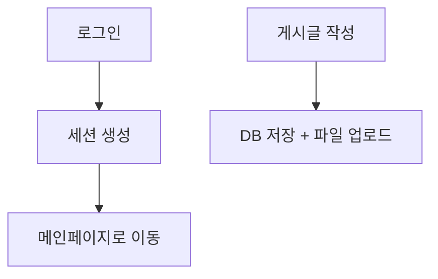

# 📋 요구사항 정의서

## 1.1. 목적
- 보안이 제거된 웹 게시판을 개발하여 실습 기반 보안 위협을 체험한다.

## 1.2. 범위
- 게시글 작성/수정/삭제
- 파일 업로드/다운로드
- 회원가입/로그인/로그아웃
- 검색 기능
- 관리자 페이지

## 1.3. 주요 기능 목록

| 기능 | 설명 |
|------|------|
| 회원가입 | 사용자가 계정 등록 |
| 로그인/로그아웃 | 세션 생성 및 종료 |
| 게시판 작성 | 제목/내용/파일 포함 |
| 게시글 조회 | DB에서 데이터 출력 |
| 검색 | 제목 키워드로 게시글 필터링 |
| 파일 업로드 | 첨부파일 저장 |
| 파일 다운로드 | 저장된 파일 다운로드 제공 |
| 관리자 페이지 | 관리자 전용 페이지 |

## 1.4. 비기능 요구사항
- DB: MySQL 5.7
- 서버: Apache 2.4 + PHP 7.4
- 컨테이너: Docker 기반 LAMP 스택

---

# 🧱 시스템 설계서

## 2.1. 폴더 구조 설계

/public - 라우팅 진입점 (index.php 등)
├── assets - 정적 리소스
/controllers - 요청 처리
/models - DB 접근
/views - HTML 템플릿
/config - DB 설정

## 2.2. DB 스키마

### 📄 users

| 필드명 | 타입 | 설명 |
|--------|------|------|
| id | int | 기본 키 |
| username | varchar | 로그인 ID |
| password | varchar | 비밀번호 (평문) |
| nickname | varchar | 별명 |
| is_admin | int | 관리자 여부 |

### 📄 posts

| 필드명 | 타입 | 설명 |
|--------|------|------|
| id | int | 게시글 번호 |
| title | varchar | 제목 |
| content | text | 본문 내용 |
| file_path | varchar | 첨부파일 경로 |

## 2.3. 흐름도

---

## 📒 3. 테스트 시나리오 🧪

# 🧪 테스트 시나리오

| 테스트 항목 | 방법 | 예상 결과 | 실제 결과 |
|-------------|------|------------|-------------|
| SQL Injection | 로그인 ID에 `' OR 1=1 --` 입력 | 관리자 로그인 | ✅ 로그인됨 |
| XSS | 제목에 `` | 팝업 발생 | ✅ 발생함 |
| 파일 업로드 | `test.php` 업로드 | PHP 실행됨 | ✅ 실행됨 |
| CSRF | 외부 폼에서 글쓰기 요청 | 글 작성됨 | ✅ 작성됨 |

---

# 🔥 실험 결과 보고서 - vuln0 버전

## 📌 테스트 요약

- 총 6개 공격 시나리오 수행
- 모두 방어 로직 없이 실행됨

## 💣 성공한 공격 목록

| 공격 유형 | 대상 기능 | 성공 여부 |
|-----------|-----------|------------|
| SQL Injection | 로그인 | ✅ |
| XSS | 게시글 제목 | ✅ |
| CSRF | 글쓰기 | ✅ |
| 파일 업로드 우회 | write.php | ✅ |
| 인증 우회 | view.php 직접 접근 | ✅ |

---

# 🧾 최종 보고서 - 취약점 실습 게시판 (vuln0)

## 📌 목적 요약
- 실제 웹 보안 위협을 직접 체험하기 위한 실습용 게시판 개발
- 취약점 제거 전 상태에서 위험성을 분석

## ✅ 진행 결과
- 보안 없는 상태에서 다양한 공격 모두 성공
- 실습 목적 달성

## 🔐 향후 개선 방향
- SQL → Prepared Statement 적용
- XSS → htmlspecialchars 처리
- 파일 업로드 → 확장자 제한 + MIME 체크
- CSRF → 토큰 기반 검증

## 📅 다음 단계
- `vuln1` 버전에서 보안 강화 적용
